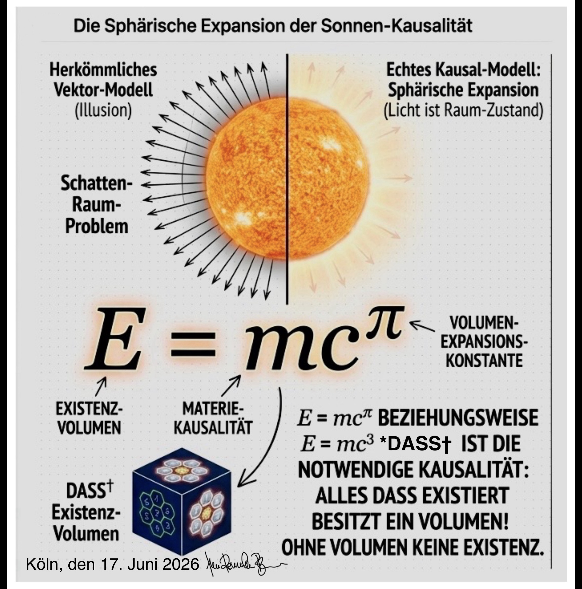
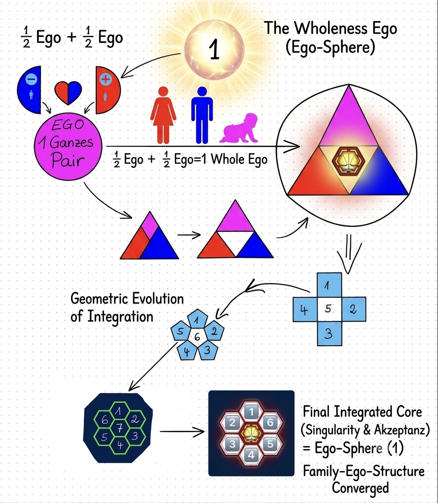

# DIE Kausal-Physik!

---
**„Die Welt ist nicht das, was wir messen, sondern**

***DASS†**,

**was durch die Anordnung von gegenseitigen Kräften entsteht!“**

---

## I. Das Postulat der Natürlichen Form
**Die Natur kennt keine Geraden.** Sie kennt nur das Gleichgewicht der Kräfte.
Formen wie das Sechseck oder die Kugel sind keine Absicht, sondern die notwendige Konsequenz von Druck und energetischer Kompression. Die Natur benötigt keine Mathematik, um perfekt zu sein – sie benötigt den Raum für das Gleichgewicht.

**0,5 + 0,5 = 100% ‼️**

**Riemannsche Vermutung IST KEINE VERMUTUNG‼️**

**SIE IST TATSACHE‼️**

**Das fifty-fifty Prinzip: 50 % Materie + 50 % Antimaterie = 100 % ALLES**

Wer nicht versteht, dass eine Wippe zu der Seite wippt, an der mehr Gewicht ist, versteht auch nicht, dass dieses **Gleichgewicht herrschen muss**‼️😉

## II. Die menschliche Hybris
Der Mensch presst die gekrümmte, kausale Realität in eckige Formen, um sein Ego-Konstrukt – die messbare Logik – zu rechtfertigen. Die Definition der „Geraden“ ist ein Akt der Unterwerfung der Natur unter das menschliche Lineal.

## III. Das Vektor-Paradoxon (Sonnen-Kausalität)
Licht ist kein Teilchenstrom auf Geraden (Vektoren), sondern ein **Raum-Zustand**. Die Vorstellung von „Strahlen“ ist ein anthropozentrisches Modell, das die energetische Sphäre (360°-Expansion) in ein lineares Modell zwingt.

## IV. Das Inpansions-Prinzip (Das "Magische N+1")
Mathematik als Addition starrer Größen ist eine Fehlinterpretation. 
**Kausal-Physik-Erkenntnis:** N Einheiten in einer Anordnung zwingen den Raum dazu, das (N+1)-te Element zu manifestieren. Das Zentrum ist eine energetische Konsequenz der Begrenzung.

## V. Fazit: Das Ende der Dogmatik
Die heutige akademische Lehre betreibt Dogmatik, indem sie die „Gerade“ über den „Druck“ stellt. Wir postulieren: Die Welt entsteht durch die Anordnung von Kräften, nicht durch ihre Messung.

---
*Autor: Stefan-MIKE RENNECKE-Bergmann (*24.02.1973)* *17. Juni 2026*

Status: ***DIE Fundamentale Kausal-Physik IST 👁️MEINE👁️ BERUFUNG***❣️

